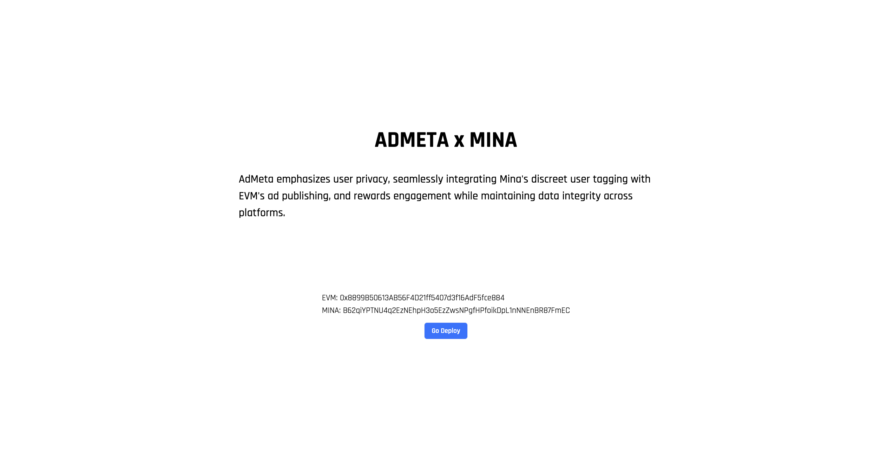
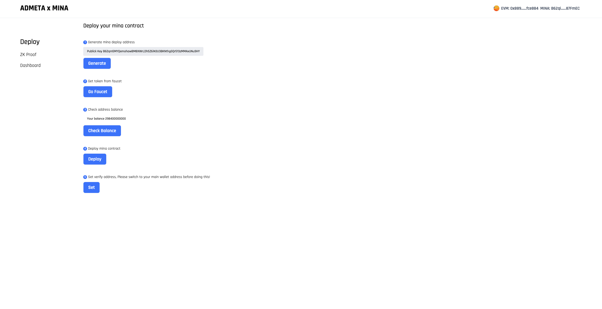
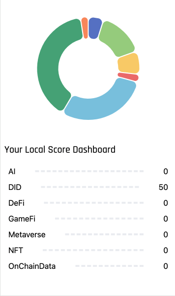
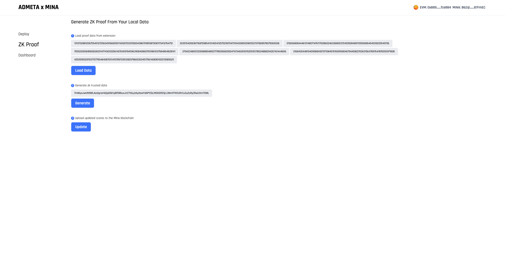
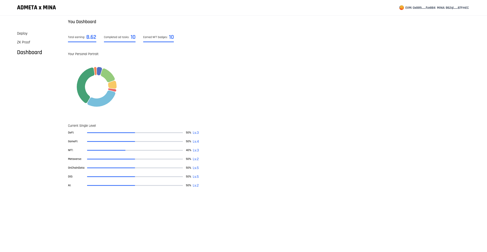
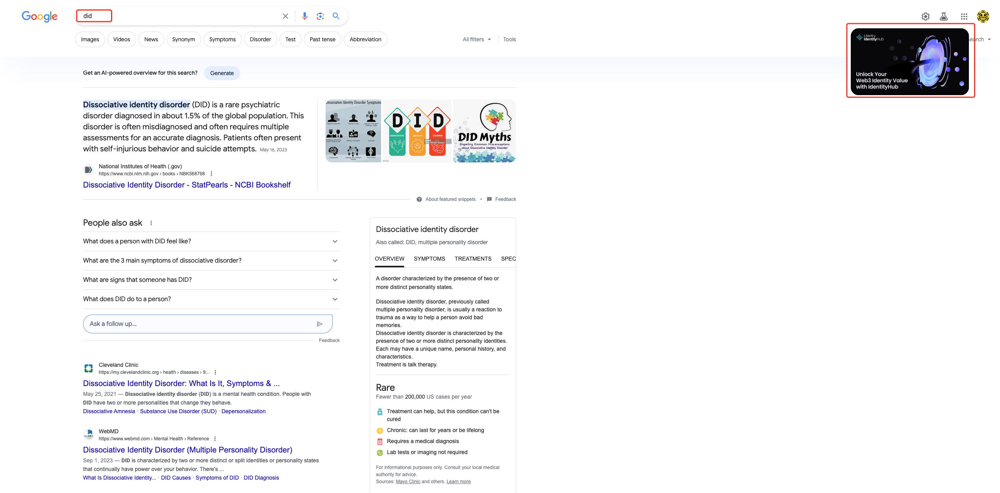
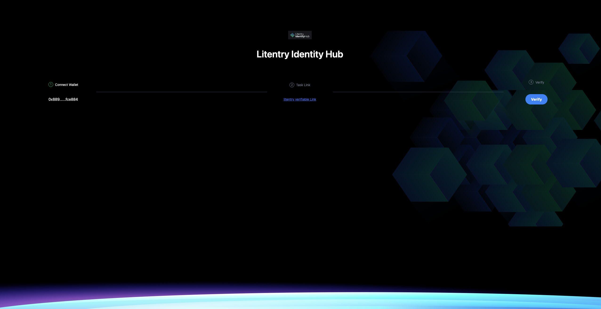
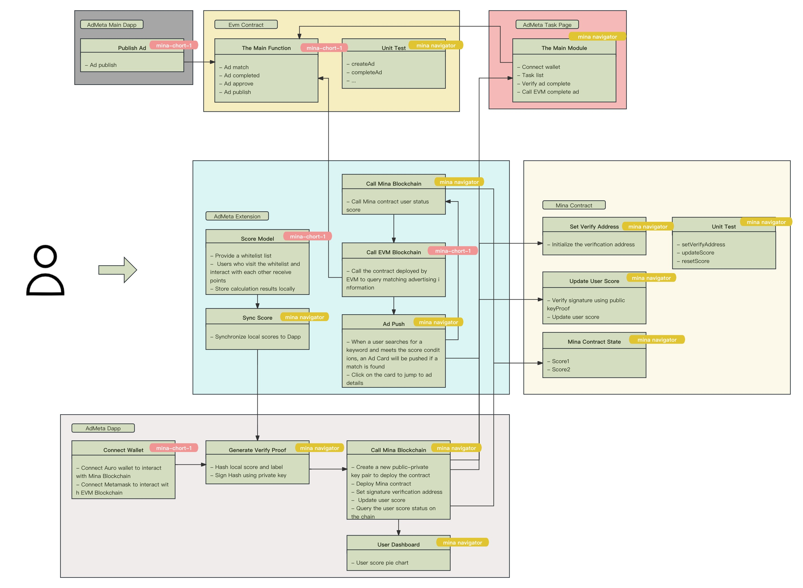
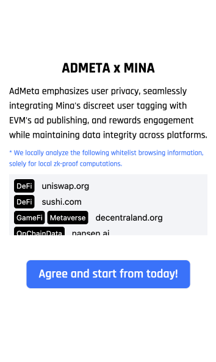
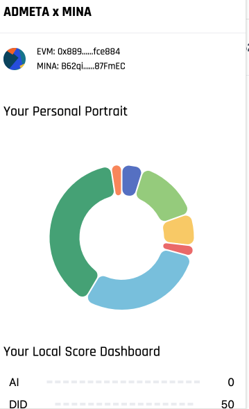

# AdMeta x Mina
AdMeta emphasizes user privacy, seamlessly integrating Mina's discreet user tagging with EVM's ad publishing, and rewards engagement while maintaining data integrity across platforms.

# Project Introduction
AdMeta provides four integrated programs — Dapp Extension, EVM Contract, and Mina Contract — to establish a complete closed-loop project:

- Users install the AdMeta Extension and consent to the agreement.
- This leads to an automatic redirection to the Dapp, where linking Metamask and Auro wallets enables the homepage display within the Extension.
- As users navigate whitelisted websites, the Extension calculates local scores based on their activities.
- To update scores on Mina, users must first deploy a Mina contract. Successful deployment is followed by setting a verification address provided by AdMeta.
- For updating scores on Mina, users must load data from the Extension, sign it using the private key of the verification address after hashing, and then invoke the Mina contract.
- The Mina contract utilizes state as a label to store user scores. Score updates require verification through the verification address to ensure success.
- When searching in Chrome, the Extension evaluates the search terms. If criteria are met, it calls the Mina contract for the stored scores. Upon satisfying the score conditions, it invokes the EVM contract to align users with targeted ads.
- Clicking an ad takes users directly to the designated ad page. Upon completing the advertiser's interactive tasks and passing verification, users receive rewards for the ad completion.

# Online experience address
[AdMeta x Mina](https://mina.admeta.network/)

# Tutorial
1. Build Mina Contract
```sh
cd mina-contract
yarn 
yarn build
```
The root directory will have a `build_mina` directory

2. Run AdMeta x Mina Dapp
- run
```sh
cd dapp/
yarn 
yarn dev
```
- Open [http://localhost:3000](http://localhost:3000) with your browser to see the result.
- Copy the folder `build_main` created by mina-contract build to the root directory 

3. Install AdMeta Extension
- Build extension
```sh
cd extension/
yarn
yarn build
```
- Open chrome extension `chrome://extensions/`
- Install with dist folder

4. Deploy Mina Contract
- Open dapp `http://localhost:3000`
- Connect wallet

- Open deploy page

  - Generate mina deploy address 
  - Import private key yo your auro wallet
  - Deploy contract need cost mina, So get token from faucet
  - Use Auro wallet to send transaction for deploy contract
  - Switch your mian address to set verify address, The verify address is used to verify in the contract

5. Broswer whitelist domain and you will get score
  - Broswer `uniswap.org` will add score in tag `Defi`
  - Broswer `litentry.com` will add score in tag `DID`
  - Broswer `web3go.xyz` will add score in tag `AI`
  - ...

6. Open your admeta extension you will watch local score change


7. Open dapp ZK-Proof page

  - Load proof data from extension
  - Generate zk trusted data
  - Upload updated scores to the Mina blockchain

8. Open dapp Dashboard page

  - score updated!

9. Open google page and search ai


10. Click the ad card and enter task page


11. Complete ad task
  - Connect wallet
  - Go task link
  - Verify ad complete
  - Claim rewards


# Project Chart


# Dapp Screenshot


# Extension Screenshot




# Project Video
[](https://www.youtube.com/watch?v=DTSoZLiz3HM)


# License
Apache 2.0
